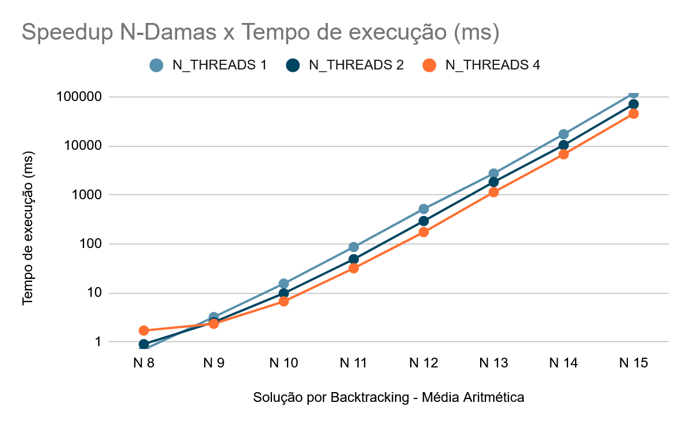
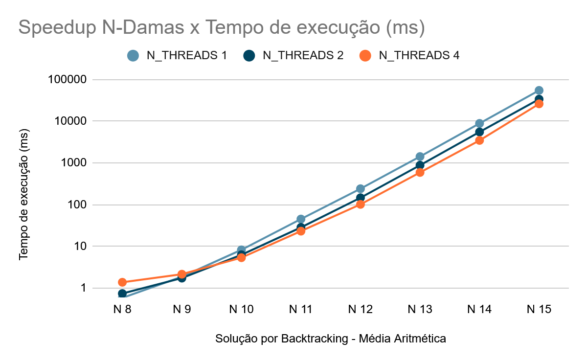
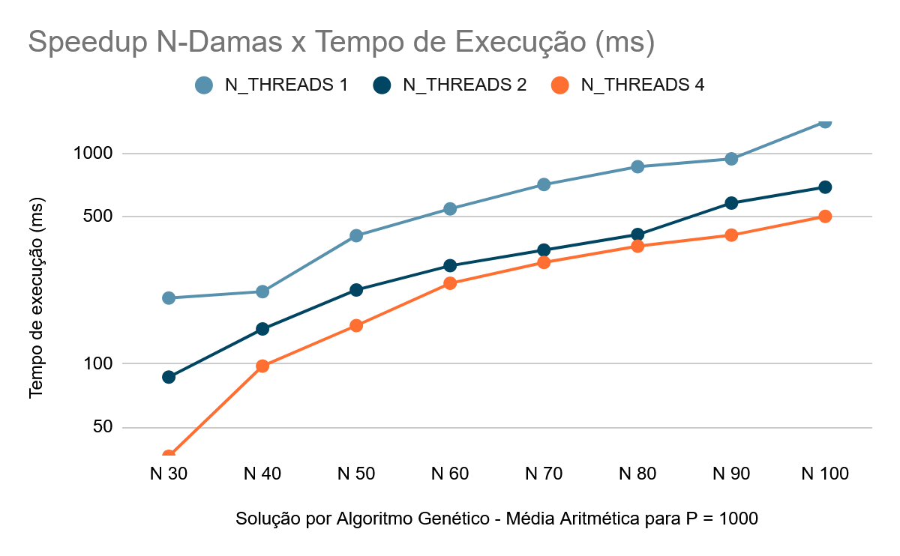
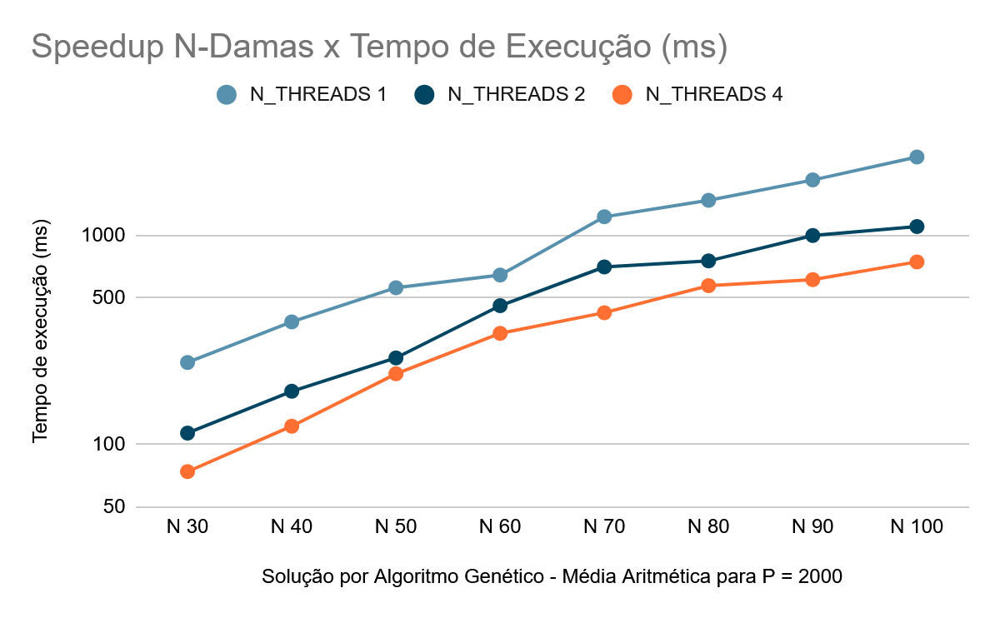

# Métodos de Otimização do Problema das N-Damas
Trabalho de Graduação desenvolvido pelo aluno Anael Fernando Porto para a disciplina de ES/TG - 2º Sem. 2025 - Integral e Noturno.

Este projeto apresenta uma análise sobre métodos de otimização de algoritmos que resolvem o Problema das N-Damas. O projeto foi desenvolvido por meio de diferentes implementações de algoritmos na linguagem C, com parâmetros variados que visam balancear desempenho e estabilidade dos dados, sendo estes posteriormente filtrados por dois algoritmos de média simples e desvio padrão. O estudo desenvolvido contribui para uma melhor visualização do tema e fornece uma base estável para a expansão do espaço de busca e melhorias computacionais.

Proposto inicialmente no século XIX, o problema consiste em posicionar N damas em um tabuleiro de xadrez NxN de modo que elas não se ataquem, ou seja, não compartilhem linhas, colunas ou diagonais. É possível abordar diversas vertentes do problema para um intervalo ou conjunto de valores de N, como a tentativa de obter uma solução válida a partir de um tabuleiro vazio, a contagem de todas as soluções e a checagem de completude a partir de uma configuração inicial. Neste projeto, vamos abordar as duas primeiras. 

Para N = 4, temos apenas duas configurações válidas, representadas na figura a seguir: 
S1 = {{0, 1, 0, 0}, {0, 0, 0, 1}, {1, 0, 0, 0}, {0, 0, 1, 0}};
S2 = {{0, 0, 1, 0}, {1, 0, 0, 0}, {0, 0, 0, 1}, {0, 1, 0, 0}}.

<figure style="text-align: center;">
  
  <figcaption>Soluções válidas para N = 4</figcaption>
</figure>

A contagem de todas as soluções possíveis para um valor de N possui complexidade exponencial, podendo ser feita por um algoritmo simples de Backtracking para valores pequenos de N.
A checagem de conflitos pode ser feita em tempo polinomial, sendo comum utilizar algoritmos de busca heurística que tentam, sem garantia, encontrar uma solução válida para valores grandes de N. 

Após um estudo inicial, foram escolhidos e implementados dois algoritmos na linguagem C, tanto na versão sequencial quanto na paralela: (1) um algoritmo de Backtracking com Poda Inteligente, que conta todas as soluções; e (2) um Algoritmo Genético, que busca obter uma única solução válida. 

A análise final do projeto foi estruturada a partir da comparação da média e do desvio padrão dos tempos de execução em diferentes condições de simulação, tomando como referência a contagem de soluções do backtracking e as soluções válidas encontradas pelo algoritmo genético.
Os gráficos abaixo contém as respectivas médias dos tempos execução obtidos nas simulações:

<table>
    <tr>
        <td> Backtracking sem flag de otimização</td>
        <td> Backtracking com flag de otimização</td>
    </tr>
    <tr>
        <td> Genético P=1000 com flag de otimização</td>
        <td> Genético P=2000 com flag de otimização</td>
  </tr>
</table>

Na contagem feita pelo Backtracking, a aplicação da flag de otimização (-O3) resultou em ganho médio entre 32% e 45% em relação aos tempos de execução da versão sequencial. 
Na versão paralela, houve perda de desempenho nos valores de N = {8, 9}, causada pelo overhead de criação e sincronização das threads. A partir de N = [10, 15], observou-se um ganho médio entre 30% e 50% em comparação à implementação sequencial.
Os dados do desvio padrão evidenciam que o uso do modelo estático na divisão de problemas combinatórios gera custo ao dividir tarefas muito simples em valores pequenos e leva a tempo inativo das threads em valores grandes.

Na tentativa de solução feita pelo Algoritmo Genético, a aplicação da flag de otimização (-O3) proporcionou redução média de 50% a 65% do tempo de execução.
Na versão paralela, os ganhos médios ficaram entre 35% e 55%, com melhor desempenho a partir de N = 50.
Nesse caso, os valores elevados de desvio padrão elucidam que a natureza estocástica, somada à distribuição estática de threads, promove maior variabilidade nos tempos de execução.

Mesmo com a redução do custo exponencial da solução de contagem e do custo polinomial da solução de decisão, a instabilidade do multithreading e a possibilidade de atingir a estagnação ou o máximo de gerações abrem espaço para discussões de confiabilidade, pois mostram que a limitação da distribuição de tarefas e a natureza do modelo genético seguem impactando os problemas. Nesse sentido, é possível expandir o escopo de estudo para incluir melhorias no multithreading e a substituição por outras heurísticas no problema de decisão.